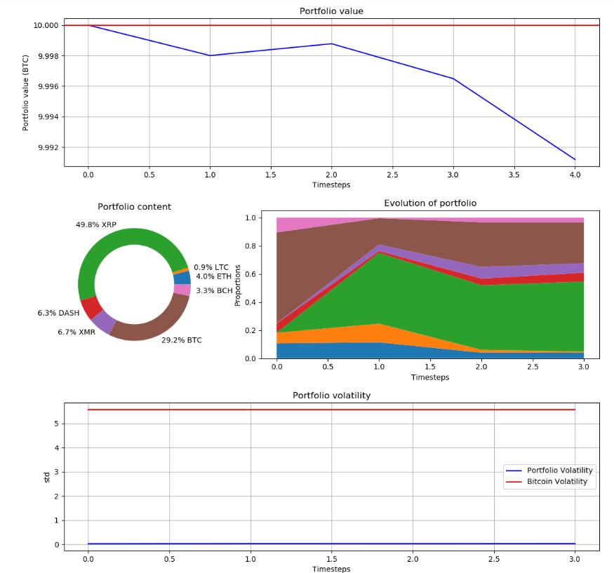

# Cryptotrading-Dashboard
Real-time dashboard from cryptocurrency trading

## Getting Started

Run the Bot.ipynb notebook.

You should get the following real-time dashboard as output. It will be continually updated every few seconds.

## Authors

* **Antoine Sueur**
